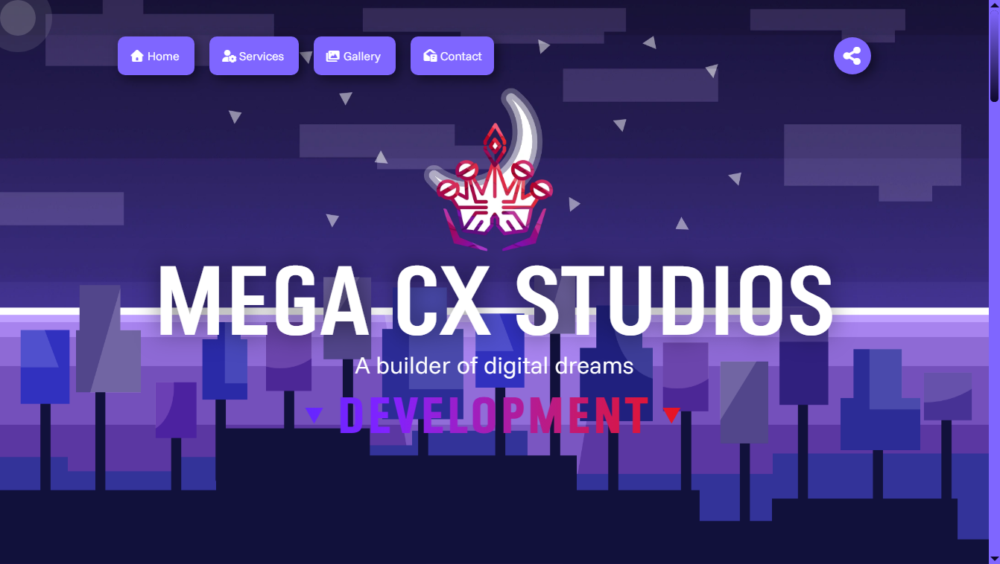

<h1 align="center">
  Mega CX Studios
</h1>

<h3 align="center">
  Personal portfolio website of Juan David Tovar Muñoz — 3D artist, web developer and designer
</h3>

<p align="center">
  <strong>
    <a href="https://juanhda-cx.github.io/index.html">Website</a>
    •
    <a href="https://www.behance.net/juanhda-cx">Behance</a>
    •
    <a href="https://www.linkedin.com/in/juan-david-tovar-munoz-3d/">LinkedIn</a>
  </strong>
</p>

<p align="center">
  <a href="https://juanhda-cx.github.io/index.html"></a>
  
  
  
</p>

<p align="center">
  
</p>

## Overview

- **Bilingual by default.** Full Spanish/English experience with per-language SEO meta, titles and keywords. The first visit auto-detects the browser language.
- **Flash-free dark mode.** The theme is painted on `<body>` before first paint, so the dark palette never flashes — regardless of connection speed.
- **A gallery that behaves like an app.** Behance-backed 3D portfolio with a full viewer: exponential wheel zoom anchored to the cursor, Escape/background close, race-safe variant switching and instant second visits via cached images.
- **Smooth scrolling everywhere.** GSAP ScrollSmoother across the site — intelligently killed while the gallery viewer is open so fixed positioning keeps working.
- **Crafted details.** Custom cursor that follows only mouse/pen devices, click sounds that gate navigation, a loader that hides when the page is functional (not when the last image downloads), and a winter snow effect on canvas.
- **SEO-ready.** Canonical URLs, Open Graph tags, `robots.txt` and `sitemap.xml` for search engines.

## Why this site exists

Portfolio work used to live scattered across Behance, with no single place to show the full process — and a static gallery that downloaded every image on load.

| Problem | Solution |
| :--- | :--- |
| Projects scattered across platforms | A central gallery driven by `gallery-database.json` that pulls Behance renditions |
| Slow gallery: every image downloaded up front | Lazy loading with data-URI placeholders — no placeholder network request, zero flash |
| Dark mode flashed light for a second on slow connections | Theme class applied pre-paint via an inline script, mirrored to `body` before rendering |
| Fixed-position viewer broken by scroll transforms | ScrollSmoother is killed on viewer open and recreated on close |
| Navigation delayed or skipped while the click sound plays | Navigation is gated by the audio `ended` event with a 1s safety timeout and last-click-wins logic |

## Tech Stack

| Layer | Technology | Used for |
| :--- | :--- | :--- |
| **Frontend** | HTML, CSS, vanilla JavaScript | Entire site, no build step |
| **Animation** | [GSAP](https://gsap.com/) — ScrollSmoother, ScrollTrigger, SplitText, TextPlugin | Smooth scrolling, parallax, text reveals, banner art |
| **Interactive art** | [Rive](https://rive.app/) | Canvas character animation on the homepage |
| **Forms** | [EmailJS](https://www.emailjs.com/) | Contact form delivery without a backend |
| **Icons** | [Font Awesome](https://fontawesome.com/) | UI and social icons |
| **Portfolio data** | Behance CDN renditions | High/low-res images referenced from `gallery-database.json` |
| **Hosting** | [GitHub Pages](https://pages.github.com/) | Static deployment from `main` |

## Pages

| Page | Purpose |
| :--- | :--- |
| [`index.html`](https://juanhda-cx.github.io/index.html) | Hero, personal story, services overview and Rive canvas |
| [`services.html`](https://juanhda-cx.github.io/services.html) | Detailed service catalogue with pricing |
| [`gallery.html`](https://juanhda-cx.github.io/gallery.html) | 3D portfolio viewer backed by Behance renditions |
| [`contact.html`](https://juanhda-cx.github.io/contact.html) | Contact form, socials and footer |
| `privacy_policy.html` / `terms_conditions.html` | Legal pages for the Ked Icon Pack app |

## Folder Structure

    .
    ├── index.html                  # Homepage
    ├── services.html               # Services catalogue
    ├── gallery.html                # Portfolio gallery and viewer
    ├── contact.html                # Contact page
    ├── styles.css                  # Design system: palettes, dark mode, components
    ├── main.js                     # Theme, language, sounds, loader, cursor, SEO meta
    ├── anim.js                     # GSAP scroll effects and parallax
    ├── menuMobile.js               # Mobile navigation
    ├── snowflake.js                # Winter canvas snow effect
    ├── gallery-database.json       # Behance project data for the gallery
    ├── robots.txt / sitemap.xml    # Search engine files
    ├── icons/                      # Brand icons and favicons
    ├── src/                        # Images and SVG assets
    ├── sound/                      # Click sound effects
    └── screenshots/                # README captures

## Development

The site is pure static files — no build step, no dependencies to install.

### Running locally

```sh
git clone https://github.com/JUANHDA-CX/JUANHDA-CX.github.io.git
cd JUANHDA-CX.github.io
```

Serve the folder with any static server, for example VS Code's [Live Server](https://marketplace.visualstudio.com/items?itemName=ritwickdey.LiveServer) or Python:

```sh
python -m http.server 5500
```

Then open `http://localhost:5500/index.html`.

> ⚠️ Opening the files directly via `file://` will not load `gallery-database.json` due to browser CORS policies — always use a local server.

### Deployment

GitHub Pages serves the site from the `main` branch. Any push to `main` is live within a minute at <https://juanhda-cx.github.io/>.

## Versioning

The footer version is bumped per release (`Version 3.6` on every page, plus a git tag).

**3.6 highlights**

- Rebuilt gallery viewer: zoom-to-cursor wheel, Escape/background close, race-safe variant switching, dynamic alt text, data-URI placeholders and instant second visits
- ScrollSmoother toggled around the viewer so smooth scroll and fixed positioning coexist
- Dark-theme flash eliminated with a pre-paint `body` class
- Click-sound gated navigation with a safety timeout and menu `li` support
- Language auto-detection and per-language title/description/keywords
- Loader hides at `DOMContentLoaded`, not at `load`
- Canonical URLs, `robots.txt`, `sitemap.xml` and deferred external scripts
- Winter snow effect and new gallery projects (Lautaro Condominium, Living Space Studio, Azure Dawn, Oh! Oh! Oreo, Fractal Alligator Handbag)

## Acknowledgements

- [GSAP](https://gsap.com/) and [Jack Doyle](https://github.com/greensock) for the animation engine
- [Rive](https://rive.app/) for the interactive canvas art
- [EmailJS](https://www.emailjs.com/) for backend-free form delivery
- [Font Awesome](https://fontawesome.com/) for the icon set
- [Behance](https://www.behance.net/) for hosting the project renditions
- Google Fonts for [Funnel Sans](https://fonts.google.com/specimen/Funnel+Sans)

## License

[MIT](LICENSE.md) © 2025 Juanda MCX

<p align="center">
  <sub>Built with care for the craft — design, 3D, code.</sub>
</p>